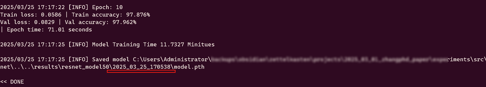
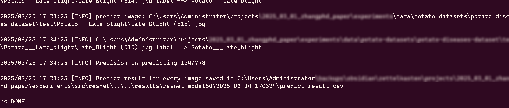

# Potatos Leaf ML Experiments
马铃薯病害叶片分类 实验

实验项目地址：[GitHub](https://github.com/jnai-team/potatos-leaf-ml-experiments) | [Gitee](https://gitee.com/jnai/potatos-leaf-ml-experiments)

实验用数据集：[GitHub](https://github.com/jnai-team/potato-diseases-dataset) | [Gitee](https://gitee.com/jnai/potato-diseases-dataset)

## Install deps

前提条件：

* Python ~3.11 (3.9 - 3.11；不要使用最新的 Python 3.13, 较多兼容性错误)
* Pip

## Clone code

将代码下载到 `ROOT_DIR` （ROOT_DIR 是自定义的路径，比如 C:\git）目录，在命令行[^20250712112234]中执行下面命令：

```bash
# 在 Git Bash 中执行
cd $ROOT_DIR
git clone git@gitee.com:jnai/potatos-leaf-ml-experiments.git
```

继续安装 pip 依赖：

```bash
# 在 Git Bash 中执行
cd $ROOT_DIR/potatos-leaf-ml-experiments # 进入刚刚下载好的代码地址
./bin/001.install_deps.sh   # 安装 Python 依赖
```

# Data

## Download data

下载数据集到目录 `$ROOT_DIR/data`：

```
cd $ROOT_DIR
git clone git@gitee.com:jnai/potato-diseases-dataset.git data
```

所以，数据集的路径就是：
* Development Data - $ROOT_DIR/data/train
* Test data - $ROOT_DIR/data/test


# Train and predict

Copy `sample.env` to `.env`, config model trainer in `.env`, by default they are 

```
MODEL_TRAIN_SCRIPT=resnet/model50_train.py
MODEL_PREDICT_SCRIPT=resnet/model50_predict.py
```

Scripts are all placed under `src`.

## Train model

Run script to train model.
```
bin/002.train_model.sh
```

After the training, model files are saved into a dir in `$ROOT_DIR/results`, e.g.



The dirname `2025_03_25_170538` is `MODEL_ID` which is used later.

## Predict model

First, edit `.env` file again, add following info.

```
MODEL_ID=2025_03_24_170324
PREDICT_TARGETS_DIR=C:\Users\Administrator\backups\obsidian\zettelkasten\projects\2025_03_01_zhangphd_paper\experiments\data\test\Potato___Early_blight,C:\Users\Administrator\backups\obsidian\zettelkasten\projects\2025_03_01_zhangphd_paper\experiments\data\test\Potato___healthy,C:\Users\Administrator\backups\obsidian\zettelkasten\projects\2025_03_01_zhangphd_paper\experiments\data\test\Potato___Late_blight

```

Replace `C:\Users\Administrator\backups\obsidian\zettelkasten\projects\2025_03_01_zhangphd_paper\experiments` with your `ROOT_DIR` path, more explanation - 

`PREDICT_TARGETS_DIR` stores folders concatenating with comma, each folder contains images, and the images are assumed labeled as their folder name, another sytanx of `PREDICT_TARGETS_DIR` is also supported -

```
PREDICT_TARGETS_DIR=FolderA#LabelA,FolderB#LabelB[...]
```

After setting `PREDICT_TARGETS_DIR` in `.env`, run the following script to get predict result -

```
bin/003.predict_images.sh
```

Check out the console log for predict details.




# Contributing

* format code

```
./bin/fmt_code_py.sh
```

# Licesne
[LICENSE](./LICENSE)

# Refs

[^20250712112234]: Windows 比如 Git Bash，Linux Bash Shell.