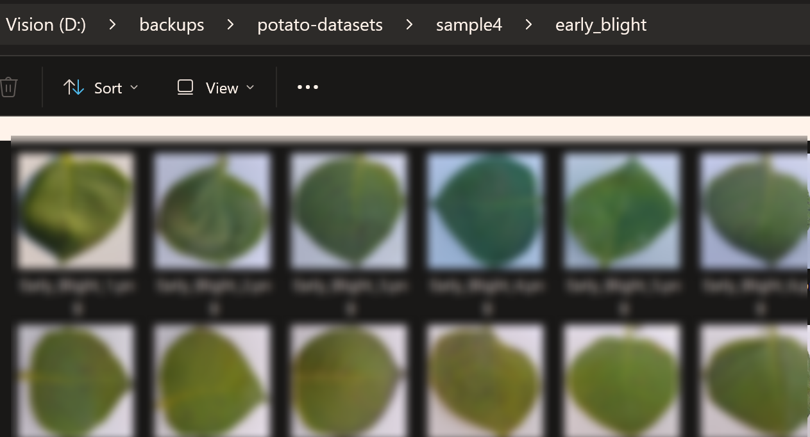

# Potatos Leaf ML Experiments
马铃薯病害叶片分类 实验

[https://github.com/jnai-team/potatos-leaf-ml-experiments](https://github.com/jnai-team/potatos-leaf-ml-experiments)

## Install deps

前提条件：

* Python ~3.11 (3.9 - 3.11；不要使用最新的 Python 3.13, 较多兼容性错误)
* Pip

继续安装 pip 依赖：

```bash
cd $ROOT_DIR
./bin/000.install_deps.sh   # 在 Git Bash 中执行
```

## Data

### 下载

下载数据集 Sample4：根目录下是每个分类的文件夹，每个分类的图片在该文件夹内。



TODO 提供数据集位置。

### 配置

因为现在都是做图片分类。用哪个数据集，数据集位置，超参数等，使用配置文件 `.env` 进行配置，示例 sample.env

复制配置文件。

```
cd $ROOT_DIR
cp sample.env .env
```

然后使用 VSCode 或 Notepad 打开 .env 文件。

## Train Steps

Run script to split data.

```
./bin/001.preprocess_data_sample4.sh
```

After that, a new folder is generated.


# Licesne
[LICENSE](./LICENSE)